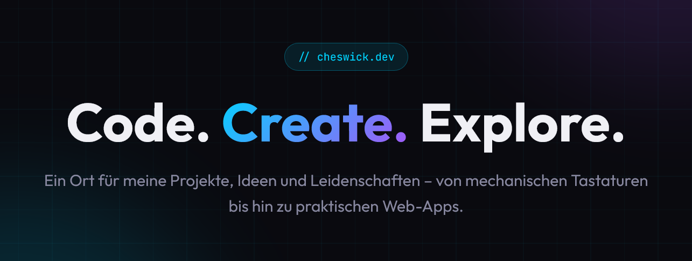

  

  

    
    

<h1 align="left">Hi 👋, I'm Cheswick</h1>
<h3 align="left">Tech-Enthusiast, Vibecoder & Keyboard Enthusiast</h3>

Welcome to my digital playground. I love optimizing things whether it's the perfect mechanical keyboard, a monitor setup, or an elegant code solution.

- 🔭 I'm currently working on **<a href="https://github.com/CheswickDEV/Fleets-Enhanced">Fleets Enhanced</a>**
- 🌱 I'm currently exploring **Ansible, Powershell & AI LLMs**
- ⌨️ Passionate about **Mechanical Keyboards & Custom Builds**
- 🌍 Location: **Germany**

 

 

---

<h3 align="left">🛠️ Languages and Tools</h3>

  
  
  
  
  
  

---

<h3 align="left">🔥 Featured Repositories</h3>

| Project | Description | Tech |
| :--- | :--- | :--- |
| **[🧠 Claude Prompt Optimizer](https://github.com/CheswickDEV/claude-opus-4.6-prompt-optimizer)** | Meta-prompting system that transforms raw prompts into production-ready, XML-structured prompts. | `AI` `Prompt Engineering` |
| **[🚗 Fleets Enhanced](https://github.com/CheswickDEV/Fleets-Enhanced)** | Firefox extension for fleet management with availability heatmaps and tax benefit calculations. | `JavaScript` `Firefox` |
| **[🎬 YT Comment Timeline](https://github.com/CheswickDEV/Youtube-Comment-Timeline-Overlay)** | Visualize YouTube comments directly on the video timeline with timestamp markers. | `JavaScript` `Firefox` |
| **[🛡️ Kleinanzeigen Filter](https://github.com/CheswickDEV/Kleinanzeigen-Filter)** | Filter bots & scalpers on Kleinanzeigen.de by seller registration date. | `JavaScript` `Firefox` |

---

<h3 align="left">📈 GitHub Stats</h3>

 
 

<h3 align="left">📫 Connect with me</h3>

